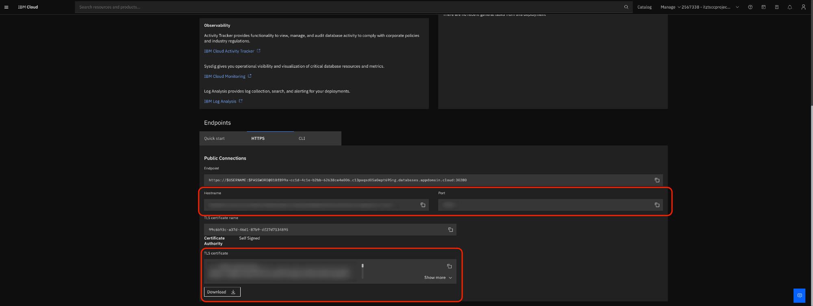
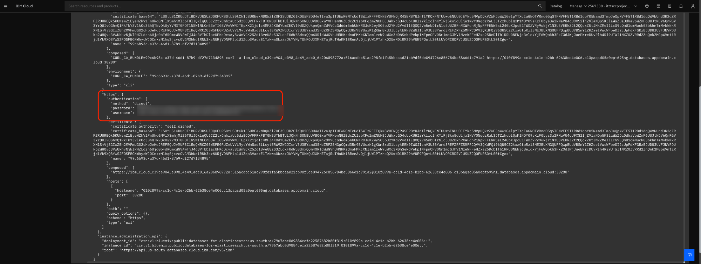

# Setting Up and Ingesting Files into Elasticsearch

This repository contains Python 3.10 code assets designed to configure an instance of **Elasticsearch** and ingest files into an index in **Elasticsearch**. The stored files are embedded using Elastic's ELSER model and can be used for use-cases such as Retrieval Augmented Generation.

Currently supported file types:
| File Type | Loader |
| --- | --- |
| `.pdf` | [LlamaHub PDF Loader](https://llamahub.ai/l/readers/llama-index-readers-file?from=readers) |
| `.docx` | [LlamaHub Docx Loader](https://llamahub.ai/l/readers/llama-index-readers-file?from=readers) |
| `.pptx` | [LlamaHub Pptx Loader](https://llamahub.ai/l/readers/llama-index-readers-file?from=readers) |
| `.txt` | [LlamaHub Unstructured File Loader](https://llamahub.ai/l/readers/llama-index-readers-file?from=readers) |
| `.html` | [LlamaHub Unstructured File Loader](https://llamahub.ai/l/readers/llama-index-readers-file?from=readers) |

Currently supported file locations:
1. Local directories
1. Cloud Object Storage

## Table of Contents

- [Setting Up and Ingesting Files into Elasticsearch](#setting-up-and-ingesting-files-into-elasticsearch)
  - [Table of Contents](#table-of-contents)
  - [Prerequisites](#prerequisites)
  - [Using The Repository](#using-the-repository)
    - [Setting up the environment](#setting-up-the-environment)
    - [Connecting to Elasticsearch](#connecting-to-elasticsearch)
    - [Ingesting your documents](#ingesting-your-documents)
      - [Customize the config YAML file](#customize-the-config-yaml-file)
      - [Setup and Ingest into Elastisearch](#setup-and-ingest-into-elasticsearch)
  - [Querying Your Data](#querying-your-data)
  - [Sample Data](#sample-data)
    - [Nvidia Q\&A Text Files](#nvidia-qa-text-files)
    - [IBM Watsonx.ai Sales Documents](#ibm-watsonxai-sales-documents)

## Prerequisites

This repository assumes that you have an instance of **Databases for Elasticsearch** Platinum edition deployed on **IBM Cloud**. To deploy this service on **IBM Cloud**, see [Setting up Elasticsearch with Kibana and Enterprise Search](https://cloud.ibm.com/docs/databases-for-elasticsearch?topic=databases-for-elasticsearch-tutorial-elasticsearch-enterprise-search-tutorial). The Platinum edition is required to use the ELSER model in **Elasticsearch**, which is leveraged for semantic search. If this is not available, you can also test this repository using **Elasticsearch** deployed on an Openshift cluster or locally. For guidance on deploying Elasticsearch locally, refer to the [official Elasticsearch documentation](https://www.elastic.co/guide/en/elasticsearch/reference/current/run-elasticsearch-locally.html), or use the Dockerfile provided in the `container_setup` directory.

## Using The Repository

### Setting up the environment

To start using the repository, first clone the repository into a local directory. Then, create a virtual environment and install the requirements to run the Python scripts onto the environment. Run the code provided below to create the virtual environment and install the ncessary requirements

``` shell
python3 -m venv .venv
```
```shell
source .venv/bin/activate
```
```shell
pip install -r requirements.txt
```

When running code from the repository, make sure that the environment you have created is active

### Connecting to Elasticsearch

Once you have set up the repository with the necessary requirements, the next step is to authenticate to your Elasticsearch service.

To authenticate to Elasticsearch, you will need:

- username
- password
- hostname
- port
- SSL certificate

<details> 
<summary> Expand for details on how to get these values from Databases for Elasticsearch on IBM Cloud </summary>

If you have a Databases for Elasticsearch configured on IBM Cloud, you can get these values by going to your resource list in IBM Cloud and selecting Elasticsearch under your database resources. 

1. In the overview tab of your Elasticsearch resource, scroll to the bottom and select the https endpoint. Here, you will find your **hostname**, **port**, and **SSL certificate**.

    

    Note the **hostname** and the **port**, and save a copy of the **SSL certificate** to a directory in this repostiory

1. Next, go top the service **credentials** tab and expand the **service credentials**. Note the **username** and **password**.

    

    </details>


Once you have these credentials, make a .env file containing these credentials. To do so, go to the ```elastic``` folder inside the repository and copy the contents of the ```.envExample``` file into a new file called ```.env```. To populate this file:

- Replace the value after ```ELASTIC_URL``` with ```https://<hostname>:<port>``` 
- Replace the value after ```ELASTIC_USERNAME``` and ```ELASTIC_PASSWORD``` with the username and password for Elasticsearch
- Copy the relative path of the SSL certificate you copied into the repository, and replace the value after ```ELASTIC_CERT_PATH``` with the relative path

(Optional) To verify whether you are able to connect to Elasticsearch, try to instantiate an Elasticsearch Python client and test its connection. The command below should run without error if the values in the .env file are inputted correctly

``` shell
python3 elastic/utils.py
```

### Ingesting your documents
The next step is to source your documents that you wish to ingest into Elasticsearch. Documents can be ingested into Elasticsearch via a directory on your local machine or through a bucket in Cloud Object Storage on IBM Cloud. Currently, the supported file types are `.pdf, .txt, .docx, .pptx`. Note that not all `.pptx` files may be supported. 

- If you wish to ingest documents through a local directory, save all the documents to a directory and note the path of the directory. All documents within the directory path will be ingested.

- If you wish to ingest documents through Cloud Object Storage, load the files documents into a bucket in your configured instance of Cloud Object Storage and save the name of the bucket. For details on setting up a Cloud Object Storage bucket, refer to this documentation [Getting started with Cloud Object Storage](https://cloud.ibm.com/docs/cloud-object-storage/basics/archive.html?topic=cloud-object-storage-getting-started-cloud-object-storage). 

A small collection of sample documents is provided below in the [sample data section](#sample-data).

#### Customize the config YAML file

The scripts for setting up Elasticsearch and ingesting your documents can be configured via a YAML config file. A sample config is provided in the `configs` folder of the repository. Using the `sample_config.yaml` file, create a new config file and populate the values as described below


| Field                                  | Default Value   | Description                                                                                       |
|----------------------------------------|--------------------------|---------------------------------------------------------------------------------------------------|
| `ingest.file_store.type`               | `local`                  | The type of file store. Can be `cos` (Cloud Object Storage) or `local`.                           |
| `ingest.file_store.location`           | `data/nvidia/answers`    | If `cos`, the name of the bucket. If `local`, the directory path.                                 |
| `ingest.file_store.service_credentials_path` | `null`              | The path to the service credentials if `cos` is the type of file store.                                                              |
| `ingest.file_store.num_files_to_ingest` | `500`                   | The number of files to ingest.                                                                    |
| `ingest.elasticsearch.index_name`      | `new-doc-index` | The name of the index to ingest into.                                                             |
| `ingest.elasticsearch.index_text_field`| `body_content_field`     | The name of the field in the index used to store document text.                                   |
| `ingest.elasticsearch.index_embedding_field` | `sparse_embedding` | The name of the field in the index used to store embeddings. 
| `ingest.elasticsearch.pipeline_name`   | `elser_ingestion`          | The name of the pipeline within Elasticsearch to use for ingestion. Will be created if it doesn't already exist     |
| `ingest.elasticsearch.embedding_model_id` | `.elser_model_2`       | The name of the embedding model to use for ingestion.                                             |
| `ingest.elasticsearch.embedding_model_text_field` | `text_field`   | The name of the field the embedding model looks for text in.                                      |
| `ingest.chunk_size`                    | `512`                     | The number of tokens per chunk.                                                                   |
| `ingest.chunk_overlap`                 | `128`                      | The number of tokens to overlap between chunks.                                                   |
| `query.num_docs_to_retrieve`           | `3`                       | The number of documents to retrieve on querying. NOTE: only used by query.py, which this repo is not supporting currently                |
| `query.llm_path`                       | `configs/llm_config/llms/wml_granite_13b_chat_config.json` | The path to the LLM configuration. NOTE: only used by query.py, which this repo is not supporting currently                                                            |
| `query.prompt_template_path`           | `configs/llm_config/prompt_templates/basic_rag_template.txt` | The path to the prompt template. NOTE: only used by query.py, which this repo is not supporting currently    |

#### Setup and Ingest into Elasticsearch
Once you have finished making your config file, copy the path to your config and run the following python script if you need to setup Elasticsearch. 

- Run the `setup.py` script to setup Elasticsearch. Skip this step if you already have an Elasticsearch database configured:

  ```shell
  python3 elastic/setup.py [-s -d ] -c "path/to/your/config/file.yaml"
  ```

  This script will use the configuration file and does the following in sequence:

  1. Tries to activate a trial Elasticsearch license if -s is specified, ignores if not
  2. Downloads and deploys the model defined in config as `embedding_model_id` from Elastic's servers if -d is specified, ignores if not

- To ingest your documentation, run the `ingest.py` script:
  ```python
  python3 elastic/ingest.py -c "path/to/your/config/file.yaml"
  ```
  This script will use the configuration file and does the following in sequence:

  1. Creates an index with the index name specified in the config file based on ```elastic/configs/index_config.json``` and a default pipeline with a name specified in the config file based on 
  ```elastic/configs/inference_pipeline_config.json```
  2. Use the pipeline to ingest your documents into the index based on the fields under the `ingest` section of the config. 

Once ingestion is complete, your documents are ready to be used for RAG use cases. 

### Querying Your Data

Within Kibana attached to your Elasticsearch database, go to the **Management->Dev Tools** console, enter this command below any other commands.  

```
GET <index_name>/_search
{
    "query":{
        "text_expansion":{
            "ml.<embedding field name>":{
                "model_id":"<model id>",                  
                "model_text":"<query>"
            }
        }
    }
}
```


Then click the **>** to left of the command to execute it

Note: 
- **index_name**: name of the index containing your ingested documents with embeddings
- **embedding field name** `token` is what the script defaults to using for embedding field.  If you chose an alternative, use that here
- **model id**: Id of the embedding model downloaded and deployed into your Elasticsearch instance. This is located in the Elasticsearch Kibana UI instance under **Analytics->Machine Learning->Trained Models**.
- **query**: the question being asked to find withing the document index

## Sample Data

### Nvidia Q&A Text Files
To test this repository for basic functionality, a CSV file in ```data/nvidia``` called ```data/nvidia/NvidiaDocumentationQandApairs.csv``` has been provided. This CSV file contains a set of questions and answers related to NVIDIA. If you would like to test the repository with this file, run the following:
1. Generate a collection of documents by converting each answer into an individual document by running ```data/nvidia/nvidia_processing.py```. This script will create a new subfolder called "answers" and write each row in the "answer" column in the CSV to a text file. There are a total of ~7000 rows in this csv. The source for this CSV can be found [here](https://www.kaggle.com/datasets/gondimalladeepesh/nvidia-documentation-question-and-answer-pairs/data)

    ```shell
    python3 data/nvidia/nvidia_processing.py
    ```

2. The ```sample_config.yaml``` file is configured to use the files generated by the script in the previous step. Use the command below to set up an index named ```index-created-in-setup-ingestion-repo-sample-config``` and ingest the generated .txt files into the index.

    ```shell
    python3 elastic/ingest.py -c "elastic/configs/setup_and_ingest_configs/sample_config.yaml"
    ```

### IBM Watsonx.ai Sales Documents
To test the repository against a more robust set of documents, here is a link to a [box folder](https://ibm.box.com/s/5lxisye5k379lwn0puisbp1d5g9461h9) that contains a few sales-oriented documents regarding Watsonx.ai from Seismic. This set of documents contains PDF, Docx, and Pptx. With the exception of "watsonx.ai Client Presentation.pptx", the repository is able to handle all the documents in the folder. To use this document set, follow the steps below:
1. Follow the link to the box folder and copy the folder contents to a local directory
1. In the ```ibm_config.yaml``` file in ```configs```, change ```ingest.file_store.location``` value to the path of the folder where the contents were copied to
1. (Optional) Rename the ```ingest.elasticsearch.index_name``` value to another name of choice
2. Use the same scripts ```elastic/setup.py``` to set up and ```elastic/ingest.py``` to ingest documents to Elasticsearch, but this time point the script to the     
    ```shell
    python3 elastic/ingest.py -c "elastic/configs/setup_and_ingest_configs/ibm_config.yaml"
    ```


